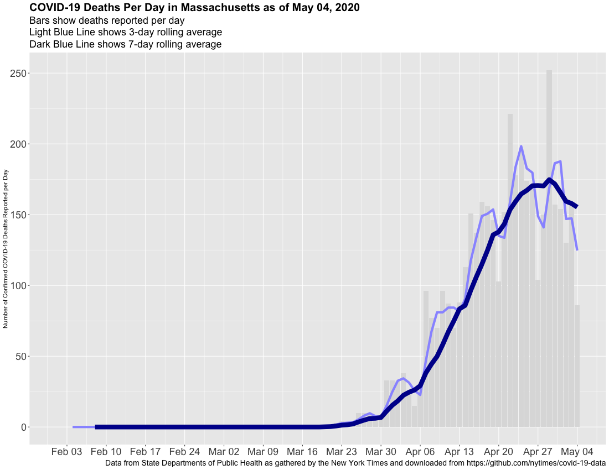

# covid-us-charts
This is some relatively simple R code which creates state-level charts showing deaths per day, along with 3-day and 7-day rolling mean values. It downloads the data collated by the New York Times, hosted on GitHub, and does some simple calculations. It runs in R, and uses a number of libraries including ggplot2.

This code is shared freely in case anyone finds it valuable. I created it during the third week of April, 2020 because I was not seeing data that was presented showing trends in a useful fashion.

I hope that someday soon we will not need to worry about deaths from COVID-19.
